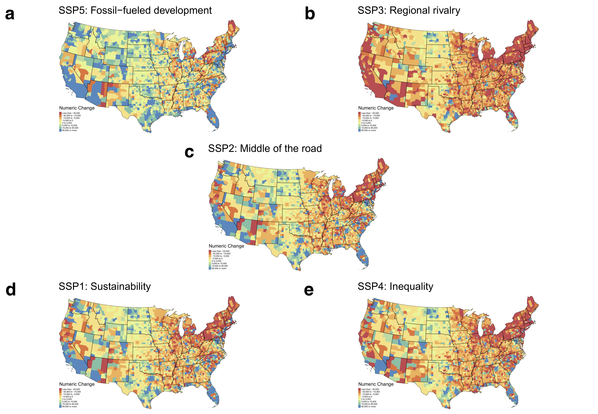

# Introduction
Here I provide the code for:  [**Population projections for all U.S. counties by age, sex, and race controlled to the Shared Socioeconomic Pathways**](https://github.com/mathewhauer/county_projections_official/blob/master/maintext.pdf)

### Citation

> Hauer, M.E. **Open Science Framework.** (DOI 10.17605/OSF.IO/9YNFC) (YEAR ACCESSED).

# Abstract

Small area and subnational population projections are important for understanding long-term demographic changes and typically take the form of a cohort-component model. Cohort-component relies on oftentimes difficult or even impossible to obtain subnational components of change due to data suppression for privacy reasons, small-cell sizes, or are simply unavailable. Cohort-Change Ratios (CCRs) are one approach that overcomes these data limitations but tend to produce unrealistic projected populations due to exponential compounding. I present a simple, parsimonious projection technique based on a variation of CCRs I call cohort-change differences (CCDs). Using ex-post facto analysis for the period 2000-2015 for 3,136 U.S. counties in temporally rectified county boundaries, eighteen five-year age groups (0-85+), two sex groups (Male and Female), and three race-groups (White, Black, Other) using CCDs in a Bayesian structural time series for the period 1969-2000, I show that CCDs produce reduced errors compared to CCRs. I then provide countylevel population projections by age, sex, and race in five-year intervals for the period 2020-2100, using Bayesian structural time series, consistent with the Shared Socioeconomic Pathways. These data and methods have numerous potential uses and can serve as inputs for addressing questions involving sub-national demographic change in the United States.

*Projected numeric population changes for the five SSPs between 2020 and 2100 for counties in the continental United States.*

# Organization
- `SCRIPTS`  — Scripts and output for figures included in the documentation.
- `DATA`  — Initial data resources, unprocessed.
- `DATA-PROCESSED` — Processed data used to create the projections.
- `FIGURES` — output figures.
- `PROJECTIONS` — contains two subfolders. `PROJECTIONS/EVAL/` contains the out-of-sample validation for the period 2000-2015. `PROJECTIONS/PROJECTIONS/` contains the actual projections.

# Use
- Feel free to create a new branch for further incorporation and analysis . 
- More information in is located in each folder `DATA`.

# Data

The projected populations by age/sex/race/county/year/SSP for all US
counties for the period 2020-2100 are available at the Open Science Foundation [https://dx.doi.org/10.17605/OSF.IO/9YNFC](https://dx.doi.org/10.17605/OSF.IO/9YNFC).

*Data resulting from these projections can be found in the file `SSP_asrc.csv.zip`.*

# Codebook

`YEAR`
- Refers to the year of each projection. 2020 -- 2100 in five-year increments.

`STATE`
- Refers to the two-digit FIPS code associated with each state.

`COUNTY`
- Refers to the three-digit FIPS code associated with each county in each state.

`GEOID`
- Refers to the five-digit FIPS code associated with each individual county and is the product of the STATE two-digit code and the COUNTY three-digit code.

`AGE`
- 0-4 = 1
- 5-9 = 2
- ...
- 80-84 = 17
- 85+ = 18

`SEX`
- Male = 1
- Female = 2

`RACE`
- White NH = 1
- Black, NH = 2
- Hispanic = 3
- Other, NH =4

# Correspondence
For any issues with the functionality of these scripts please [create an issue](https://github.com/mathewhauer/county_projections_official/issues).

## License
The data collected and presented is licensed under the [Creative Commons Attribution 3.0 license](http://creativecommons.org/licenses/by/3.0/us/deed.en_US), and the underlying code used to format, analyze and display that content is licensed under the [MIT license](http://opensource.org/licenses/mit-license.php).
